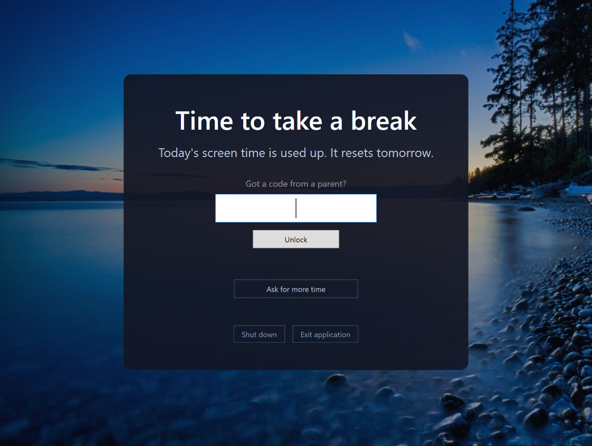
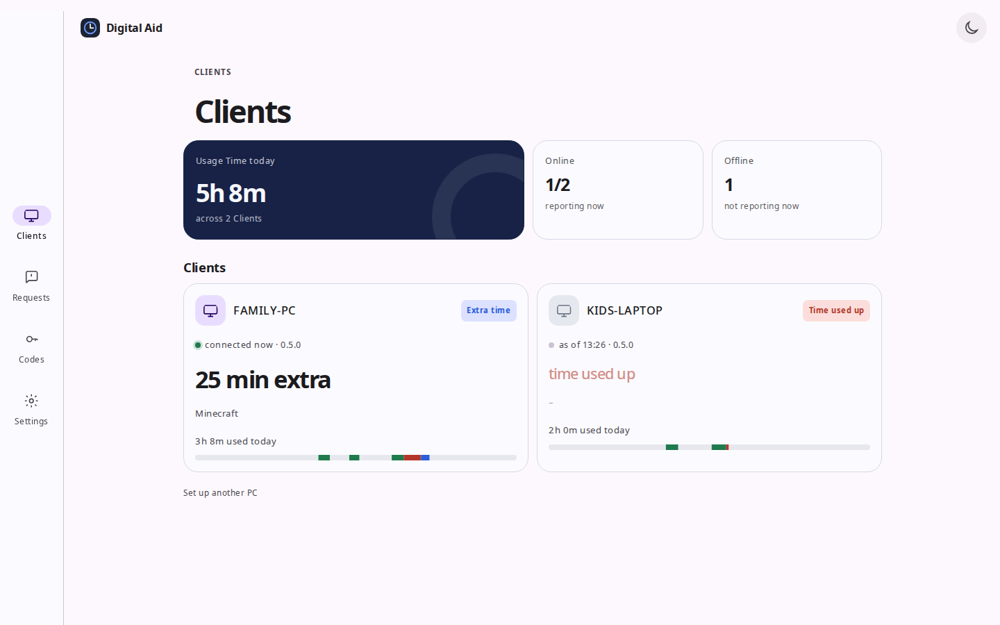
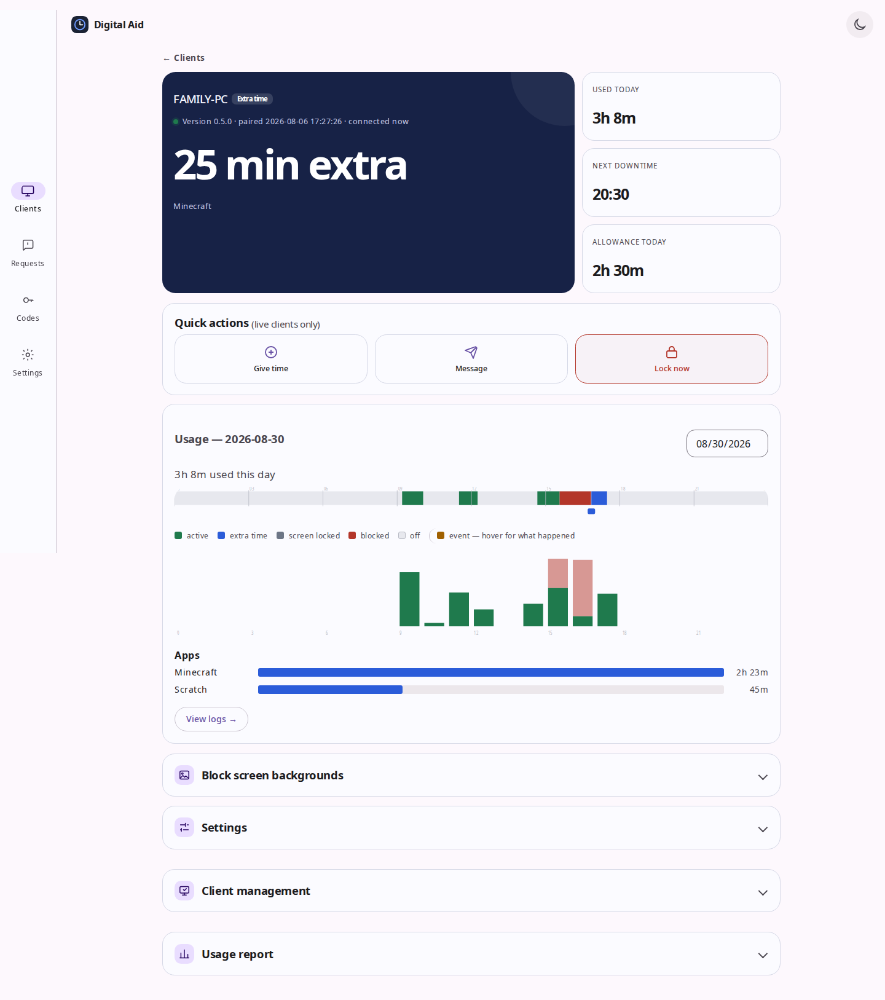
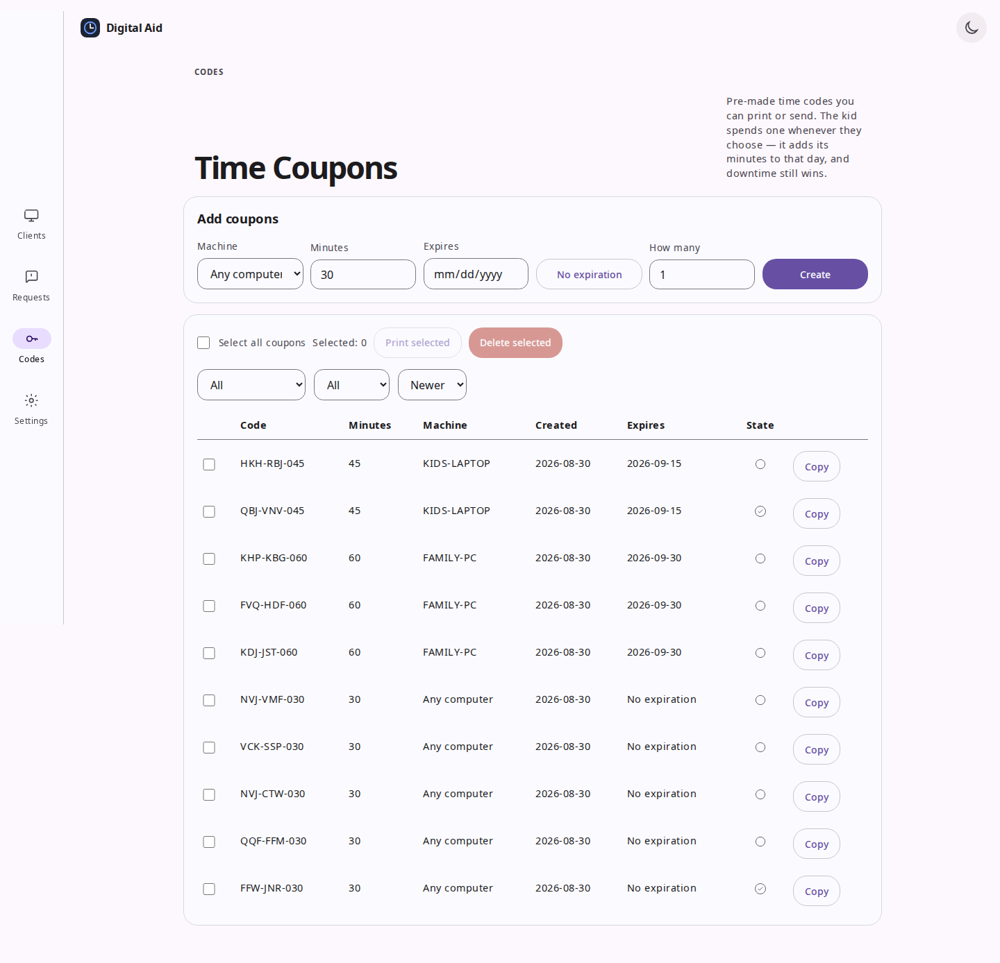
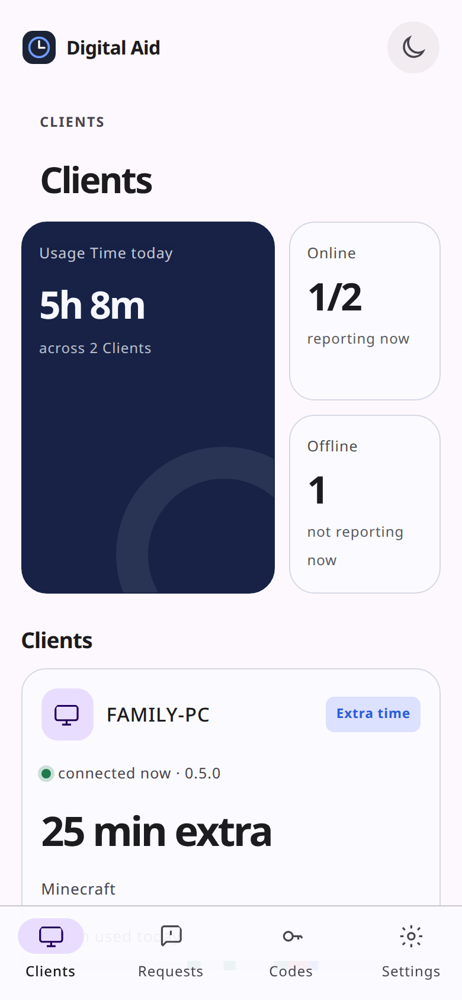
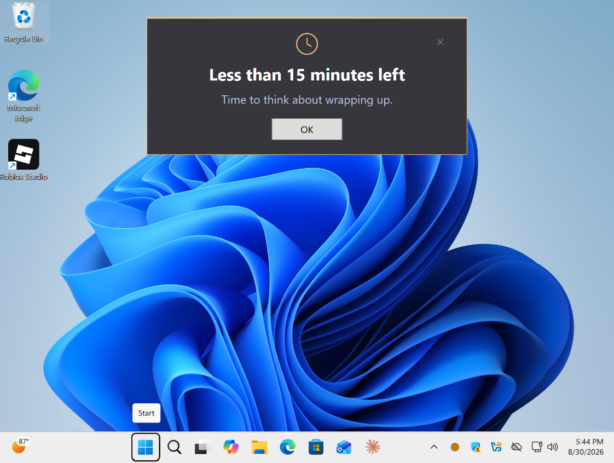
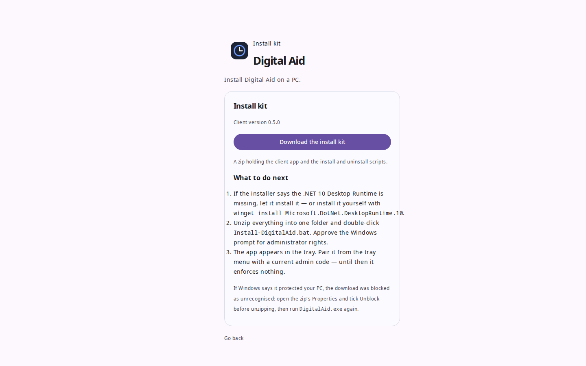

# Digital Aid

[](https://github.com/bboldi/b2.digital_aid/actions/workflows/ci.yml)
[](https://github.com/bboldi/b2.digital_aid/releases/latest)
[](./LICENSE)

Self-hosted screen-time limits for a family's Windows PCs. A small Node server holds the settings and
the history; a client app on each PC enforces the limits and keeps enforcing them when the server is
unreachable.

Built for one household — mine — and shared because the shape of it might be useful to yours.



## Why this exists

I went looking for software to help my kids find a healthy relationship with their PCs, and what I
found sorted into two piles. One pile was expensive: subscriptions priced like the problem is
permanent. The other was creepy: surveillance suites with screenshot galleries, keystroke logs, and
"stealth modes" — software built on the premise that the kid is a suspect and the parent is running
an investigation. The overlap of the two piles was large, and everything in either was more
complicated than the job.

None of it matched what I actually wanted, which was less *control* than *structure*: a clear daily
budget, a firm bedtime for the machine, a legible record we could look at together, and ways for a
kid to ask for more and sometimes get it. Help on the kid's side of the table, not a camera over
their shoulder. So I built that, and this is it.

## What it does

- **A daily allowance** per PC, with separate weekday and weekend budgets, and a **downtime** window
  each night when the PC is blocked regardless of time left.
- **A block screen** on every monitor when the time is up, preceded by warnings at fifteen and five
  minutes so it never arrives unannounced. It carries its own ways out: extra-time code, shut down,
  or exit with a parent's code.
- **Extra time** by reading a code down the phone. It is checked on the PC itself, so it works with
  the server down, the wifi off, or the router unplugged.
- **Time coupons** — pre-made codes the parent can print as paper vouchers or send in a message. The
  kid spends one whenever they choose; it adds its minutes to that day's budget (downtime still
  wins). Screen time that can be earned, gifted, and held in hand.
- **Asking for more time** from the tray — one number, no message — answered from the parent's phone.
- **A history** the parent can read: when each PC was on, when it was blocked, which app was in the
  foreground, and every code redeemed.

## Philosophy

**Visibility over enforcement.** This is not tamper-proof and does not try to be: a determined kid
can kill the process. What they cannot do is make that invisible — it lands in the log, and the log
is the point. Enforcement is the app's mechanism; teaching is the parent's job, and a conversation
that starts from an honest log beats an arms race with a teenager every time.

**Transparency cuts both ways.** There is no covert surveillance of the kid. The system records
machine state — on, off, blocked, minutes used, the *name* of the foreground app — and never content:
no screenshots, no window titles, no URLs, no keystrokes, no stealth anything. Everything it records
about the kid is shown to the kid on the same screen it shows the parent. Screenshot capture was in
the very first sketch of this project and was dropped on principle, not deferred
([PRD §9](./PRD.md)); features of that kind will be declined, however well built
([CONTRIBUTING.md](./CONTRIBUTING.md)).

**The operating system does the hard enforcement.** The kid's Windows account is a standard user;
the app is installed by an admin. That single arrangement — not a driver, not a watchdog pair, not
self-defense code — is what prevents clock changes, task edits, and uninstall. Software that fights
its own removal is indistinguishable from malware, and this project would rather be removable.

**Offline is not an edge case.** The client enforces every rule from its own local state and its own
clock. The server is the audit trail and the control panel, not a dependency — a server that is
down, stale, or unplugged does not unblock a single PC, and extra-time codes are verified on the
machine itself with no connection at all.

**Your server, your data.** Everything lives in one SQLite file on a machine you own. No cloud, no
account, no telemetry, nothing phones home. The server never updates itself — updating it is two
commands, run by a human, on purpose
([ADR-0011](./docs/adr/0011-the-server-does-not-auto-update.md)) — and the kids' PCs take software
only from *your* server, never from the internet
([ADR-0018](./docs/adr/0018-binaries-bootstrap-from-github-releases.md)).

**Live intent beats standing policy.** A parent's grant overrides an exhausted allowance and even
downtime — a human deciding *now* outranks a rule written last month. The precedence order is a
value judgment, written down: Grant > Downtime > Allowance.

**Simple over robust.** One admin, one process per side, one database file, no build step on the
server. Where robustness and simplicity conflict, simplicity wins and the gap is logged.

## A look at it

| | |
|---|---|
|  |  |
| The family's PCs at a glance — live state, time left, foreground app. | One PC: history, controls, grants, lock. |
|  |  |
| Minting and tracking time coupons. | The same admin on a phone — it installs as a PWA. |

| | |
|---|---|
|  |  |
| The fifteen-minute warning — time never runs out unannounced. | A message from the parent, delivered on the spot. |

## Shape of it

| | |
|---|---|
| [`server/`](./server) | Node 22 · Fastify · SQLite · server-rendered EJS. One process, one file, no build step. Installs on a phone as a PWA. |
| [`client/`](./client) | .NET 10 · WPF. `Client.Core` is the enforcement engine, pure and testable; `Client.App` is the Windows shell around it. Self-updates from the server. |

The two halves talk over a WebSocket, and the messages are frozen in
[PROTOCOL.md](./PROTOCOL.md) — enough to write your own client against.

## Installing

You need: an always-on box for the server (a NAS, a Pi, an old laptop — anything that runs Node 22),
and admin rights on the kids' Windows PCs. Expect the first install to take an evening.

### 1. The server

```
git clone https://github.com/bboldi/b2.digital_aid.git
cd b2.digital_aid/server
npm install
npm start
```

Clone the whole repository — the server serves the client's install scripts from its sibling
directory. Open `http://localhost:3000`; the first run walks you through creating the admin account.

### 2. TLS, before anything real

Client tokens travel over this URL and the phone UI needs a secure origin, so put the server behind
TLS before pairing anything. The one-liner, if you use [Tailscale](https://tailscale.com):

```
sudo tailscale serve --bg 3000
```

This also keeps the server reachable only inside your own tailnet — nothing exposed to the internet.
Any other reverse proxy with a certificate works too; [`server/README.md`](./server/README.md) has
the details.

### 3. The first exe

Download `DigitalAid.exe` from the
[latest release](https://github.com/bboldi/b2.digital_aid/releases/latest), then upload it on your
server's **Settings** page. Your server is now the app store: it holds the build, hands it to kid
PCs, and pushes updates to them. This GitHub download is a one-time bootstrap — no kid's PC ever
talks to GitHub ([ADR-0018](./docs/adr/0018-binaries-bootstrap-from-github-releases.md)).

Prefer to build it yourself? `cd client && ./publish.sh --test` cross-compiles from Linux and
produces an exe your server will accept, visibly marked as your own build.
[`client/README.md`](./client/README.md) explains the versioning.



### 4. Each kid's PC

The kid's account must be a **standard user** (no admin rights) — that is the enforcement model, not
a suggestion. Then, on that PC:

1. Install the .NET Desktop Runtime once: `winget install Microsoft.DotNet.DesktopRuntime.10`
2. Open your server's `/download` page in a browser — it's linked from the login screen, no password
   needed ([ADR-0015](./docs/adr/0015-the-install-kit-downloads-without-a-login.md)) — and download
   the Install Kit.
3. Unzip, double-click `Install-DigitalAid.bat`, and approve the elevation. It installs the app,
   registers the watchdog task, and starts it.
4. Pair the client with your server's URL and the family code from your admin page.

[`client/README.md`](./client/README.md) covers the details, the uninstaller, and the
`--status` diagnostics.

### Updating, later

The server: `git pull && npm install`, restart — by hand, on purpose. The clients: upload a new exe
on the Settings page; every PC updates itself within a minute, verified by hash.

## Why does Windows warn me about the exe?

Because it is not code-signed, and Windows SmartScreen says so — "Windows protected your PC", with
the *Run anyway* button hidden behind *More info*. A signing certificate costs a few hundred euros a
year, which buys a quieter dialog and nothing else; for a hobby-scale project the money is better
not spent. Be aware, too, that software which watches the foreground app and paints a topmost block
screen looks heuristically similar to malware — an occasional antivirus false positive is possible.

You should not have to take a stranger's word about an exe that supervises your children. So don't:
the client is a couple hundred kilobytes of source you can read, and `./publish.sh --test` builds it
from that source on your own machine. If you do use the released binary, its SHA-256 appears in
three places that must agree — the release page, the publish script's output, and your own server
after upload.

## Documentation

- **[PRD.md](./PRD.md)** — what it does and why, in full.
- **[CONTEXT.md](./CONTEXT.md)** — the glossary. One word per concept, in English and Hungarian. Read
  this before changing anything, and use its words.
- **[PROTOCOL.md](./PROTOCOL.md)** — the wire protocol.
- **[docs/adr/](./docs/adr)** — the decisions that were hard to reverse, and why they went that way.
  Start here when something looks strange; it probably was, once.
- **[CONTRIBUTING.md](./CONTRIBUTING.md)** — how to help, and what will be declined.
- **[SECURITY.md](./SECURITY.md)** — how to report a vulnerability, privately.

The admin UI speaks English and Hungarian; each kid's PC picks its own language
([ADR-0012](./docs/adr/0012-language-is-chosen-on-the-client.md)).

## Status

In use in one household. It works; it is not a product, and it assumes whoever runs it can read a
stack trace. Issues and patches welcome, with no promises about pace — see
[CONTRIBUTING.md](./CONTRIBUTING.md).

## About

Made by Boldizsár Bednárik · [bboldi.com](https://bboldi.com) ·
[bbednarik+digitalaid@gmail.com](mailto:bbednarik+digitalaid@gmail.com)

[MIT](./LICENSE) · Copyright © 2026 Boldizsár Bednárik
